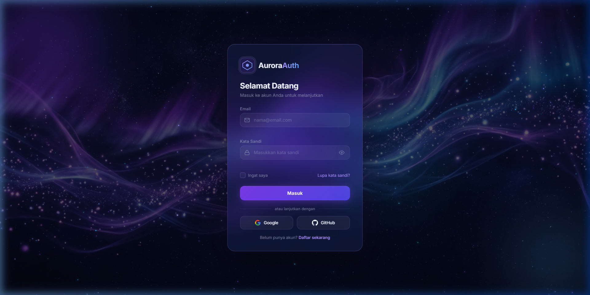
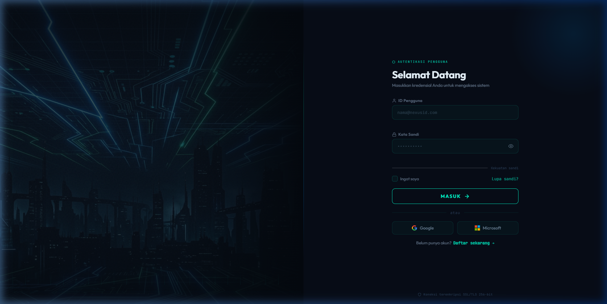

# 🎨 Login Page Templates

Koleksi template halaman login premium dengan desain modern, animasi interaktif, dan pure HTML + CSS + JavaScript — tanpa framework.

[](LICENSE)


---

## 📁 Daftar Template

### 1. 🌌 Animasi-1 — Aurora Auth
> *Glassmorphism · Dark Mode · Partikel Interaktif*



**Demo lokal:** `http://localhost/loginpage/animasi-1/index.html`

#### ✨ Fitur Utama
| Fitur | Detail |
|---|---|
| 🎨 **Tema** | Glassmorphism ungu-biru dengan background aurora |
| 🌟 **Partikel** | 140+ partikel animasi yang mengikuti kursor |
| 🖱️ **Cursor Glow** | Efek cahaya mengikuti pergerakan mouse |
| 🃏 **Tilt Card** | Kartu miring 3D mengikuti posisi kursor |
| 🔒 **Password Toggle** | Tampilkan / sembunyikan kata sandi |
| ✅ **Validasi Real-time** | Validasi email & password saat mengetik |
| 🔄 **Loading State** | Spinner animasi saat submit |
| 💥 **Ripple Effect** | Efek gelombang pada tombol |
| 📱 **Responsive** | Adaptif untuk semua ukuran layar |

#### 🗂️ Struktur File
```
animasi-1/
├── index.html   # Markup halaman
├── style.css    # Glassmorphism design system
├── app.js       # Partikel, interaksi, validasi
└── bg.jpg       # Background aurora
```

#### 🎨 Palet Warna
| Nama | Hex | Contoh |
|---|---|---|
| Background | `#050814` | ⬛ |
| Violet | `#7c3aed` | 🟣 |
| Purple Light | `#a78bfa` | 🔵 |
| Sky Blue | `#60a5fa` | 💙 |
| Cyan | `#22d3ee` | 🩵 |

---

### 2. 🤖 Animasi-2 — NexusID
> *Neon Noir · Cyberpunk · Split Layout*



**Demo lokal:** `http://localhost/loginpage/animasi-2/index.html`

#### ✨ Fitur Utama
| Fitur | Detail |
|---|---|
| 🖥️ **Split Layout** | Tampilan 50/50 kiri (visual) & kanan (form) |
| 🌧️ **Matrix Rain** | Hujan karakter digital di background |
| ⌨️ **Typing Effect** | Teks berganti otomatis 5 frasa berbeda |
| 📊 **Counter Animasi** | Angka statistik (Uptime, Enkripsi, Latensi) |
| ⬡ **Hex Logo** | Logo hexagon SVG dengan animasi rotate & glow |
| 💪 **Password Strength** | Indikator kekuatan sandi 5 level dengan warna |
| ✅ **Validasi Real-time** | Status ✓/✗ langsung pada field |
| 🔄 **Loading State** | Animasi verifikasi saat submit |
| 🔒 **Security Badge** | Badge SSL/TLS di bawah form |
| 📱 **Responsive** | Full-page pada mobile (panel kiri disembunyikan) |

#### 🗂️ Struktur File
```
animasi-2/
├── index.html   # Markup split-layout
├── style.css    # Neon Noir design system
├── app.js       # Matrix, typing, counter, validasi
└── bg.jpg       # Background cyberpunk cityscape
```

#### 🎨 Palet Warna
| Nama | Hex | Contoh |
|---|---|---|
| Background | `#04080f` | ⬛ |
| Neon Cyan | `#00f5c8` | 🩵 |
| Neon Blue | `#0099ff` | 💙 |
| Neon Purple | `#7b2fff` | 🟣 |
| Neon Green | `#00e676` | 💚 |

---

## ⚖️ Perbandingan Template

| | Animasi-1 Aurora | Animasi-2 NexusID |
|---|:---:|:---:|
| **Tema** | Glassmorphism | Neon Noir / Cyberpunk |
| **Layout** | Single Card Center | Split Screen 50/50 |
| **Background** | Partikel terbang | Matrix rain |
| **Efek kursor** | ✅ Cursor glow | — |
| **Typing effect** | — | ✅ 5 frasa |
| **Password strength** | — | ✅ 5 level |
| **Counter animasi** | — | ✅ Statistik |
| **Social login** | Google + GitHub | Google + Microsoft |
| **Font** | Inter | Outfit + JetBrains Mono |
| **Kompleksitas** | ⭐⭐⭐ | ⭐⭐⭐⭐ |

---

## 🚀 Cara Menggunakan

### Lokal (XAMPP)
1. Clone repo ini ke folder `htdocs`:
   ```bash
   git clone https://github.com/frambudi75/login-page.git
   ```
2. Jalankan Apache di XAMPP
3. Buka browser:
   - **Animasi-1:** `http://localhost/login-page/animasi-1/`
   - **Animasi-2:** `http://localhost/login-page/animasi-2/`

### Langsung di Browser
Buka file `index.html` langsung di browser modern (Chrome / Firefox / Edge).

---

## 🛠️ Teknologi

- **HTML5** — Semantic markup, ARIA accessibility
- **CSS3** — Custom Properties, Glassmorphism, Keyframe animations, Grid & Flexbox
- **JavaScript (ES6+)** — Canvas API, requestAnimationFrame, Form Validation
- **Google Fonts** — Inter, Outfit, JetBrains Mono

> ⚠️ Tidak menggunakan framework atau library apapun. Pure vanilla stack.

---

## 📸 Screenshots

<table>
  <tr>
    <td align="center"><b>Aurora Auth (Animasi-1)</b></td>
    <td align="center"><b>NexusID (Animasi-2)</b></td>
  </tr>
  <tr>
    <td></td>
    <td></td>
  </tr>
</table>

---

## 📄 Lisensi

Proyek ini dilisensikan di bawah [MIT License](LICENSE) — bebas digunakan, dimodifikasi, dan didistribusikan.

---

<p align="center">
  Dibuat dengan ❤️ oleh <a href="https://github.com/frambudi75">frambudi75</a>
</p>
